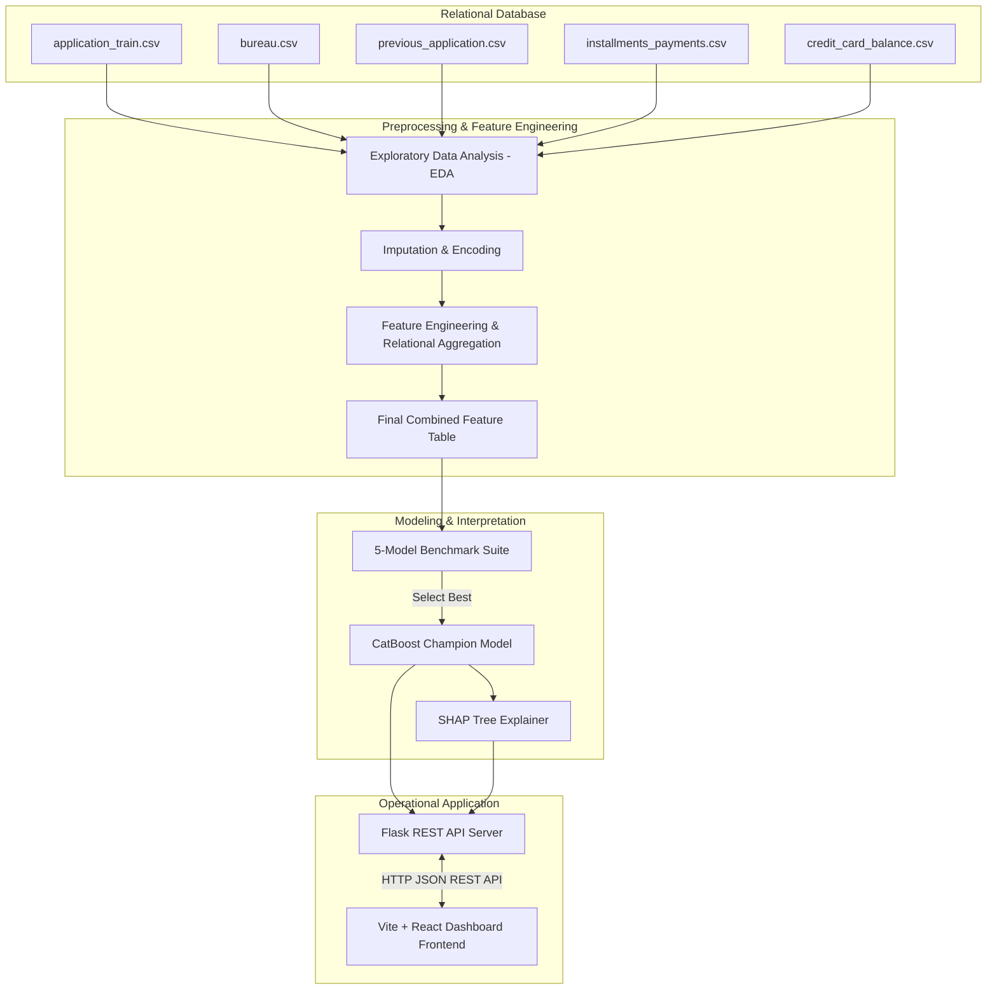

# 🏦 PreDelinq AI — Credit Risk Intelligence Platform

An enterprise-grade, end-to-end credit risk modeling system and Explainable AI (XAI) dashboard designed to predict customer delinquency and automate loan underwriting decisions.

[](https://www.python.org/)
[](https://catboost.ai/)
[](https://flask.palletsprojects.com/)
[](https://react.dev/)
[](https://tailwindcss.com/)
[](https://github.com/shap/shap)

---

## 📌 Project Overview

In retail banking, predicting credit risk is the cornerstone of capital preservation. When a customer defaults, financial institutions lose not only the unpaid principal but also incur substantial recovery costs. Traditional rule-based underwriting models fail to capture complex, non-linear interactions across customer demographics, external bureau history, and recent payment behaviors.

**PreDelinq AI** is a professional credit risk intelligence platform built to simulate industry-standard banking risk assessment workflows. Using a multi-table relational dataset, the platform:
* Calculates a calibrated **Probability of Default (PD)** for incoming applicants.
* Map continuous risk metrics into actionable **Risk Segments** (Low, Medium, High).
* Integrates **SHapley Additive exPlanations (SHAP)** to provide regulatory-compliant local and global explainability.
* Provides a **full-stack operational dashboard** for risk analysts to evaluate portfolios and process new applications.

---

## 🚀 Key Highlights

* **Processed 307K+ Customer Records**: Successfully aggregated multiple relational databases representing demographic, external credit bureau, and historical installment behaviors.
* **Engineered 193 Predictive Features**: Designed domain-specific credit metrics including debt-service-to-income ratios, payment delay flags, and external credit source scores.
* **Built an End-to-End ML Pipeline**: Implemented modular data cleaning, imputation, transformation, and class imbalance mitigation.
* **Compared 5 Machine Learning Models**: Benchmarked Logistic Regression, Random Forest, XGBoost, LightGBM, and CatBoost.
* **SHAP Explainability**: Delivered local explanations to satisfy Basel III / GDPR "Right to Explanation" requirements for credit decisions.
* **Production-Grade Architecture**: Designed a clean separation of concerns with a modular Flask REST API and a premium React.js frontend.

---

## 📊 Dataset Source

This project utilizes the official **[Kaggle Home Credit Default Risk](https://www.kaggle.com/competitions/home-credit-default-risk)** dataset.

In developing markets, many individuals lack a traditional credit score, preventing them from accessing capital. Home Credit addresses this financial inclusion barrier by analyzing alternative transactional, behavioral, and relational data.

### Relational Tables Used

| Table Name | Description | Key Features |
| :--- | :--- | :--- |
| **`application_train.csv`** | Main application table containing applicant demographic and financial variables. | `AMT_CREDIT`, `AMT_INCOME_TOTAL`, `EXT_SOURCE_1/2/3` |
| **`bureau.csv`** | Historical credits reported by external credit bureaus on other institutions. | `DAYS_CREDIT`, `AMT_CREDIT_SUM`, `AMT_CREDIT_SUM_DEBT` |
| **`previous_application.csv`** | Past applications for credit within Home Credit. | `AMT_APPLICATION`, `NAME_CONTRACT_STATUS` |
| **`installments_payments.csv`** | Payment history for previous internal credits. | `DAYS_ENTRY_PAYMENT`, `AMT_PAYMENT` |
| **`credit_card_balance.csv`** | Monthly balance sheets and credit card utilization details. | `AMT_BALANCE`, `CNT_DRAWING_CURRENT` |

> ⚠️ **Dataset Notice**: Raw competition datasets are not included in this repository due to Kaggle licensing restrictions and file size limitations. Pre-processed sample tables are provided in the `data_samples/` directory for testing and verification.

---

## 🏗️ System Architecture

The following diagram illustrates the flow of data from raw tables down to the final React Dashboard:



---

## 📈 Development Journey

### Phase 1: Exploratory Data Analysis (`notebooks/01_eda.ipynb`)
* **Objective**: Examine dataset distribution, check missing data patterns, identify target imbalances, and analyze feature-to-target correlations.
* **Completed Tasks**: Checked target imbalance (~8% default rate), handled missing data, and discovered that the normalized variables `EXT_SOURCE_1`, `EXT_SOURCE_2`, and `EXT_SOURCE_3` were the strongest univariate default predictors.
* **Business Value**: Visualized key financial risk variables to guide downstream feature design.

### Phase 2: Feature Engineering (`notebooks/02_feature_engineering.ipynb`)
* **Objective**: Aggregate information across normalized relational files to output single customer profiles containing strong predictive signals.
* **Completed Tasks**: Cleaned anomalous entries (e.g. replaced `DAYS_EMPLOYED = 365243` with `NaN`), constructed debt-to-income and loan-to-value ratios, and computed aggregated statistical characteristics (means, sums, counts) for credit card balances, external bureau histories, and historical payment delays.
* **Business Value**: Produced the feature table `processed/final_feature_table.csv` consisting of 193 features, raising the overall baseline score.

### Phase 3: Model Development & Evaluation (`notebooks/03_model_development.ipynb`)
* **Objective**: Train, benchmark, and validate multiple machine learning models to identify a high-performance classifier for loan underwriting.
* **Completed Tasks**: Benchmarked Logistic Regression, Random Forest, XGBoost, LightGBM, and CatBoost. Configured SHAP explanation metrics, mapped risk boundaries, and exported the serialized binary model.
* **Business Value**: Selected the CatBoost model due to its high ROC-AUC (0.781) and solid Recall (0.699), satisfying business mandates to identify high-risk applicants.

---

## ⚙️ Feature Engineering Highlights

To squeeze predictive signal from relational data, domain-specific features were engineered:

### Financial Ratios
* **`CREDIT_INCOME_RATIO`** ($AMT\_CREDIT / AMT\_INCOME\_TOTAL$): Measures the customer's total leverage relative to annual income.
* **`ANNUITY_INCOME_RATIO`** ($AMT\_ANNUITY / AMT\_INCOME\_TOTAL$): Proxy for the Debt-Service-to-Income (DSTI) ratio.
* **`CREDIT_GOODS_RATIO`** ($AMT\_CREDIT / AMT\_GOODS\_PRICE$): Represents the Loan-to-Value (LTV) ratio of the transaction.

### Behavioral Ratios
* **`inst_pct_late`**: Percentage of past installments paid past the official due date.
* **`inst_max_delay`**: Maximum days past due (DPD) recorded on previous loans.

### Credit Bureau Features
* **`bureau_total_debt`**: Outstanding debt balances across all external loans.
* **`bureau_total_overdue`**: Current overdue balances reported by external credit bureaus.

### Credit Card Features
* **`cc_avg_utilization`**: Average utilization rate of credit cards relative to the approved limits.
* **`cc_max_utilization`**: Peak utilization rate of active credit cards indicating potential credit stretch.

---

## 🏆 Model Performance

A rigorous 5-fold cross-validation scheme was used to evaluate candidate models:

| Model | ROC-AUC | Accuracy | Precision | Recall | F1 Score |
| :--- | :---: | :---: | :---: | :---: | :---: |
| Logistic Regression | 0.766 | 0.701 | 0.170 | 0.696 | 0.273 |
| Random Forest | 0.760 | 0.729 | 0.179 | 0.656 | 0.281 |
| XGBoost | 0.779 | 0.765 | 0.201 | 0.639 | 0.306 |
| LightGBM | 0.779 | 0.743 | 0.191 | 0.673 | 0.297 |
| **CatBoost (Champion)** | **0.781** | **0.728** | **0.185** | **0.699** | **0.293** |

### Why CatBoost Won?
1. **Best Categorical Handling**: Implements symmetric trees and ordered boosting, naturally processing sparse categoricals.
2. **Robust Recall (0.699)**: Correctly identifies 69.9% of actual defaulting clients, significantly reducing credit losses.
3. **Generalization**: Most resilient to overfitting under extreme class imbalance.

---

## 🧠 Explainable AI (SHAP)

Credit decisions in modern banking require transparent auditing to satisfy fair lending guidelines (e.g., Fair Credit Reporting Act, GDPR Article 22). PreDelinq AI avoids the "black box" trap using **SHAP (SHapley Additive exPlanations)**.

### Global Explanations
Global SHAP analysis informs the risk department which features dictate portfolio-level credit scores. In our model, external credit scores (`EXT_SOURCE_x`), contract details, and payment histories were the leading macro-level indicators.

### Local Explanations
For each prediction, the system computes exact SHAP values showing how individual characteristics pushed the client's Probability of Default (PD) up or down relative to the baseline risk:

* **Risk Drivers**: High outstanding credit bureau debts (+12% PD), late payment histories (+8% PD).
* **Mitigating Factors**: Strong external source credit scores (-15% PD), stable employment histories (-5% PD).

This local output translates tabular predictions into human-readable credit decision rationales.

---

## 🛠️ Technology Stack

### Data Science & Modeling
* **Scikit-Learn**: Validation schemes, preprocessing pipelines, and baseline modeling.
* **CatBoost / XGBoost / LightGBM**: High-performance gradient boosted decision trees.
* **SHAP**: Interpretability and model explanation.
* **Pandas & NumPy**: Relational data wrangling, missing value handling, and feature calculations.

### Application Infrastructure
* **Flask & Flask-CORS**: Lightweight backend API to serve scoring requests in real-time.
* **Joblib**: Fast loading of serialized models and pre-computed SHAP explainers.
* **Vite & React.js**: Lightweight, responsive frontend client.
* **Tailwind CSS v4**: Theme styling and page layouts.
* **Recharts**: High-performance charts for portfolio risk visualisations.

---

## 📂 Repository Structure

```text
PreDelinq-AI/
├── backend/                               # Flask REST API Server
│   ├── app.py                             # Server entry point & model loading
│   ├── routes/                            # Endpoint routing (scoring, analytics, insights)
│   ├── services/                          # Business logic & SHAP singleton loaders
│   └── utils/                             # Feature calculation & recommendation services
│
├── frontend/                              # Vite + React Frontend Dashboard
│   ├── src/                               # Frontend source code
│   │   ├── components/                    # UI elements (KPICards, Sidebar, RiskGauge)
│   │   ├── pages/                         # Main views (Dashboard, Scoring, Explainability, etc.)
│   │   └── services/                      # Axios API configurations
│   ├── index.html                         # Entry HTML
│   └── jsconfig.json                      # Path aliases config
│
├── data_samples/                          # Lightweight sample records for testing
│   ├── application_sample.csv             # Raw format samples
│   └── bureau_sample.csv                  # Bureau format samples
│
├── processed/                             # Feature-engineered artifacts
│   └── final_feature_table_sample.csv     # Sample aggregated feature table
│
├── models/                                # Model binaries & segments
│   ├── best_model.pkl                     # Saved CatBoost champion model
│   ├── feature_importance.csv             # Feature importance list
│   ├── model_comparison.csv               # Evaluation history
│   └── risk_segments.csv                  # Calibrated risk bucket rules
│
└── notebooks/                             # Data Science Notebooks
    ├── 01_eda.ipynb                       # Exploratory Data Analysis
    ├── 02_feature_engineering.ipynb       # Relational Table Aggregation Pipeline
    └── 03_model_development.ipynb         # Model Training & SHAP calibration
```

---

## 📸 Screenshots

### 1. Dashboard Overview

*Provides a high-level operational overview including risk distribution trends, portfolio average PD, and active risk alerts.*

### 2. Customer Risk Analysis

*Allows loan underwriters to input applicant details, compute Probability of Default (PD), and classify them into risk tiers.*

### 3. SHAP Explanation

*Visualizes local feature-level contributions, allowing credit officers to understand exactly why a loan application is approved or denied.*

### 4. Model Performance

*Provides data scientists with ROC-AUC plots, feature importance metrics, and evaluation leaderboards.*

---

## 💻 Installation & Local Setup

The project runs completely on `localhost` without cloud dependencies. Follow these instructions to run the application locally:

### Step 1: Clone the Repository
```bash
git clone https://github.com/AbhayMahalle/PreDelinq-AI.git
cd PreDelinq-AI
```

### Step 2: Download the Datasets
1. Go to the [Kaggle Home Credit Default Risk Datasets](https://www.kaggle.com/competitions/home-credit-default-risk/data).
2. Download all files and place them inside a new directory at the root named `data/`:
   ```text
   PreDelinq-AI/data/
   ├── application_train.csv
   ├── bureau.csv
   ├── previous_application.csv
   ├── installments_payments.csv
   └── credit_card_balance.csv
   ```

### Step 3: Set Up and Start the Flask Backend
```bash
cd backend
python -m venv venv
# Windows:
venv\Scripts\activate
# macOS/Linux:
source venv/bin/activate

pip install -r requirements.txt
python app.py
```
*The backend server will spin up and listen on `http://localhost:5000`.*

### Step 4: Set Up and Start the React Frontend
Open a new terminal window:
```bash
cd frontend
npm install
npm run dev
```
*Vite will compile the code and serve the dashboard locally at `http://localhost:5173` (or `http://localhost:3000` depending on port availability).*

---

## 🔮 Future Roadmap

* [ ] **Hyperparameter Optimization**: Run advanced Bayesian hyperparameter sweeps (e.g. Optuna) on the CatBoost model.
* [ ] **Cost-Based Threshold Optimization**: Compute decision boundary thresholds that minimize actual credit dollar losses rather than standard ML loss functions.
* [ ] **Data & Concept Drift Monitoring**: Integrate automated checks (KS-test / PSI) to detect when customer attributes drift from training distributions.
* [ ] **Dockerization**: Build unified containers using Docker Compose to orchestrate backend, frontend, and registry directories.
* [ ] **Cloud Deployment**: Create automated CI/CD pipelines to deploy services onto AWS ECS or GCP Cloud Run.

---

## 🌟 Why This Project Matters

This project demonstrates the core disciplines required of a modern **Machine Learning & Risk Analytics Engineer**:

1. **Relational Data Engineering**: Moving beyond single flat CSVs to join and aggregate massive database files.
2. **Domain-Driven Feature Engineering**: Designing financial and behavioral indicators that directly capture default risks.
3. **Rigorous Validation**: Implementing robust cross-validation strategies to ensure generalization.
4. **Explainable AI (XAI)**: Recognizing that raw predictions are useless in finance without human-interpretable feature contribution details (SHAP).
5. **Full-Stack Competency**: Wrapping serialized models into responsive, operational dashboard tools designed for real business users.
