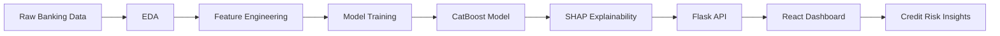

# 🏦 PreDelinq AI — Credit Risk Intelligence Platform


PreDelinq AI is an end-to-end Credit Risk Intelligence Platform that predicts customer delinquency risk using machine learning and provides explainable credit decisions through an interactive analytics dashboard.

Built using the official Kaggle Home Credit Default Risk dataset, the project simulates a real-world banking workflow used by financial institutions for loan underwriting, risk assessment, and portfolio monitoring.

---

## 🎯 Business Problem

Financial institutions lose millions due to loan defaults.

Traditional rule-based underwriting systems often fail to capture complex behavioral patterns hidden across customer demographics, bureau records, repayment history, and credit utilization behavior.

PreDelinq AI addresses this challenge by:

* Predicting Probability of Default (PD)
* Segmenting customers into risk categories
* Providing transparent AI explanations
* Supporting data-driven lending decisions

---

## 🚀 Key Achievements

### Data Engineering

* Processed 307,511+ customer applications
* Integrated 5 relational banking datasets
* Engineered 193 customer-level features
* Built scalable aggregation pipelines

### Machine Learning

* Trained and evaluated 5 industry-standard models
* Compared Logistic Regression, Random Forest, XGBoost, LightGBM, and CatBoost
* Achieved ROC-AUC of 0.781 with CatBoost
* Generated Probability of Default scores for every customer

### Explainable AI

* Integrated SHAP explainability
* Global feature importance analysis
* Customer-level prediction explanations
* Transparent risk factor reporting

### Full Stack Engineering

* Flask REST API
* React Dashboard
* Real-time credit scoring workflow
* Professional risk analytics interface

---

## 📊 Dataset Source

This project is built using the official Kaggle competition dataset:

### Home Credit Default Risk

https://www.kaggle.com/competitions/home-credit-default-risk

### Competition Objective

Many people lack sufficient credit history to obtain loans through traditional financial systems.

Home Credit uses alternative customer information to predict repayment difficulties and improve financial inclusion.

The objective is to predict:

TARGET = 1 → Customer may experience repayment difficulties

TARGET = 0 → Customer is expected to repay successfully

### Datasets Used

| Dataset                   | Purpose                                           |
| ------------------------- | ------------------------------------------------- |
| application_train.csv     | Customer demographics and application information |
| bureau.csv                | External credit bureau history                    |
| previous_application.csv  | Historical loan applications                      |
| installments_payments.csv | Installment repayment behavior                    |
| credit_card_balance.csv   | Credit card utilization patterns                  |

### Dataset Characteristics

| Metric              | Value                 |
| ------------------- | --------------------- |
| Customers           | 307,511               |
| Tables Used         | 5                     |
| Problem Type        | Binary Classification |
| Domain              | Credit Risk Analytics |
| Target Distribution | ~8% Defaults          |

> Note: Raw Kaggle datasets are not included in this repository due to licensing restrictions and GitHub storage limitations. Sample datasets are provided for demonstration purposes.

---

## 🏗️ System Architecture



---

## 📈 Machine Learning Performance

| Model               | ROC-AUC   | Accuracy  | Precision | Recall    | F1        |
| ------------------- | --------- | --------- | --------- | --------- | --------- |
| Logistic Regression | 0.766     | 0.701     | 0.170     | 0.696     | 0.273     |
| Random Forest       | 0.760     | 0.729     | 0.179     | 0.656     | 0.281     |
| XGBoost             | 0.779     | 0.765     | 0.201     | 0.639     | 0.306     |
| LightGBM            | 0.779     | 0.743     | 0.191     | 0.673     | 0.297     |
| **CatBoost**        | **0.781** | **0.728** | **0.185** | **0.699** | **0.293** |

### Best Model

🏆 CatBoost

Reason:

* Highest ROC-AUC
* Strong recall performance
* Handles categorical patterns effectively
* Stable performance under class imbalance

---

## 🧠 Explainable AI

PreDelinq AI integrates SHAP (SHapley Additive Explanations) to ensure transparency and interpretability.

### Global Explanations

Understand which features drive portfolio-level risk.

Examples:

* EXT_SOURCE scores
* Installment payment delays
* Credit utilization
* Debt burden ratios

### Local Explanations

Understand why a specific customer was classified as high risk.

Examples:

* High overdue balances
* Frequent late payments
* High debt-to-income ratio
* Poor external bureau scores

This approach aligns with modern model governance and explainable AI practices commonly used in banking and financial services.

---

## 🛠️ Technology Stack

### Machine Learning

* Scikit-Learn
* CatBoost
* XGBoost
* LightGBM

### Data Processing

* Pandas
* NumPy

### Visualization

* Matplotlib
* Seaborn

### Explainability

* SHAP

### Backend

* Flask
* Flask-CORS
* Joblib

### Frontend

* React.js
* Vite
* Tailwind CSS
* Recharts
* Axios

### Version Control

* Git
* GitHub

---

## 🚀 Reproducing the Project

Due to GitHub file size limitations, the original Home Credit datasets and generated feature tables are not included in this repository.

### Dataset Source

Download the dataset from:

https://www.kaggle.com/competitions/home-credit-default-risk/data

After downloading, create the following directory structure:

```text
PreDelinq-AI/
│
├── data/
│   ├── application_train.csv
│   ├── bureau.csv
│   ├── previous_application.csv
│   ├── installments_payments.csv
│   └── credit_card_balance.csv
│
├── notebooks/
├── processed/
├── models/
└── ...
```

### Run Phase 1 — Exploratory Data Analysis

```bash
jupyter notebook notebooks/01_eda.ipynb
```

Outputs:
- Data quality analysis
- Missing value analysis
- Risk pattern identification
- Feature discovery

### Run Phase 2 — Feature Engineering

```bash
jupyter notebook notebooks/02_feature_engineering.ipynb
```

Outputs:

```text
processed/
└── final_feature_table.csv
```

### Run Phase 3 — Model Development

```bash
jupyter notebook notebooks/03_model_development.ipynb
```

Outputs:

```text
models/
├── best_model.pkl
├── feature_importance.csv
├── model_comparison.csv
├── risk_segments.csv
└── customer_risk_scores.csv
```

### Run Phase 4 — Credit Risk Dashboard

Backend:

```bash
cd backend
pip install -r requirements.txt
python app.py
```

Frontend:

```bash
cd frontend
npm install
npm run dev
```

Application URLs:

```text
Frontend : http://localhost:5173
Backend  : http://localhost:5000
```

### Sample Files Included

To demonstrate project structure without uploading hundreds of megabytes of data, the repository includes:

```text
data_samples/
processed/final_feature_table_sample.csv
models/customer_risk_scores_sample.csv
```

These files contain small subsets of the original data and are intended purely for demonstration purposes.
